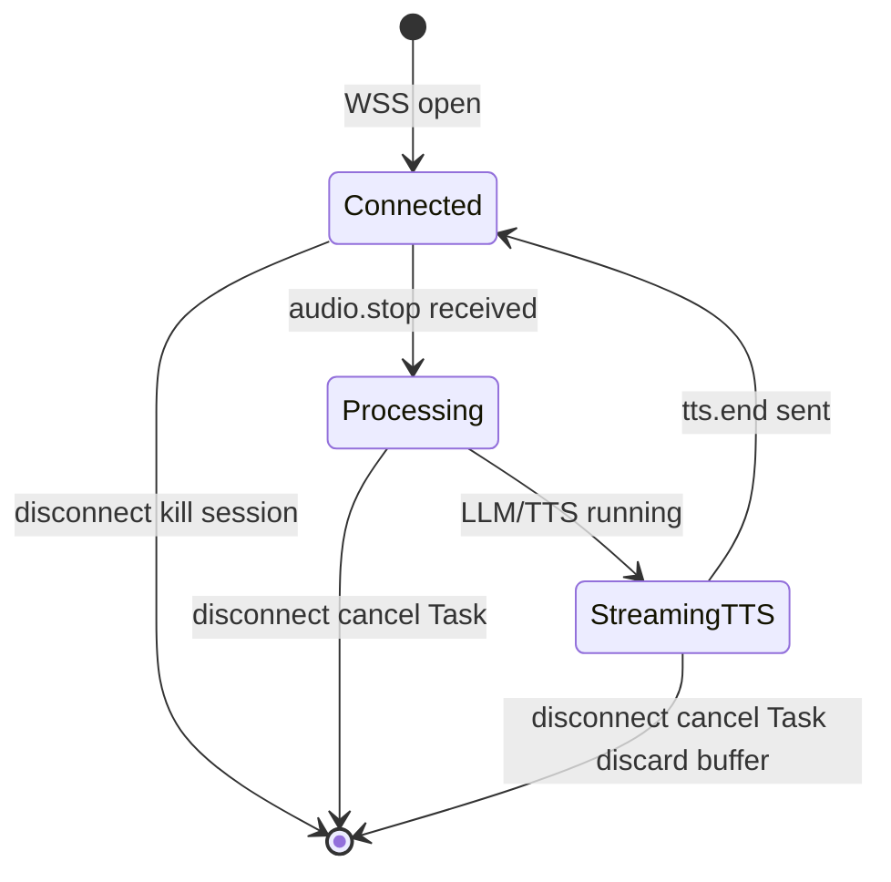
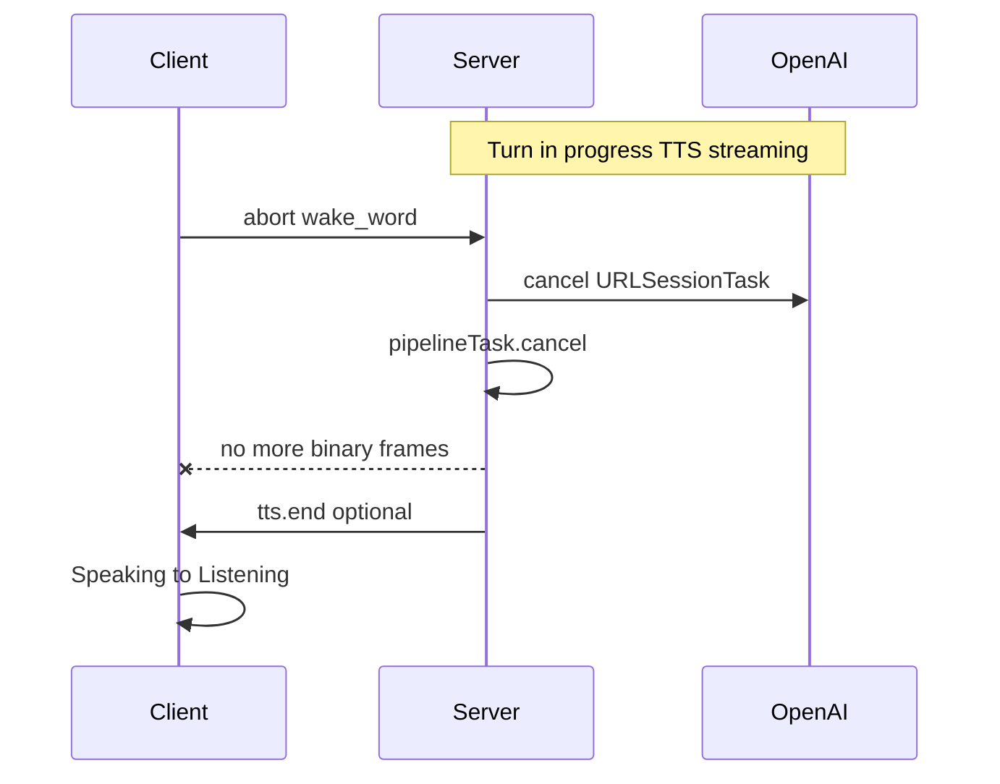

# AI Companion — Backend + ESP32 Plan

## Architecture (unchanged)

```
User ↔ ESP32 (voice + LED) ↔ CompanionServer Swift (Hummingbird WSS) ↔ OpenAI APIs
```

| Decision | Choice |
|----------|--------|
| Backend | Swift Hummingbird 2 + HummingbirdWebSocket |
| Dev client | TestClient (URLSessionWebSocketTask + AVAudioEngine) |
| Voice UX | ESP32 only — no iOS app in MVP |
| xiaozhi | Not used |
| Build order | Backend + TestClient first → firmware Phase 2 |

---

## Backend Engineering Spec (review additions)

### 1. Session state ownership — disconnect policy

**Policy: kill on disconnect. No resume. Fresh session on reconnect.**

| Event | Server action |
|-------|---------------|
| WSS close / TCP drop mid-idle | Delete session actor, release resources |
| Disconnect mid-ASR/LLM/TTS | **Immediately** cancel pipeline `Task`, cancel in-flight OpenAI `URLSessionTask`s |
| Buffered TTS not yet sent | **Discard** — do not buffer for dead connection |
| Client reconnects | New `session.start` → new `session_id` — **no** mid-stream recovery |

Rationale: Resuming 60ms Opus frame sessions after WiFi blip is not worth MVP complexity.



**Implementation:** One `actor VoiceSession` per WSS connection. Hold `pipelineTask: Task<Void, Never>?`. On disconnect handler: `pipelineTask?.cancel()`, nil out session map entry.

---

### 2. JWT / auth story

| Phase | Auth model |
|-------|------------|
| **Showcase** | Single shared `DEVICE_TOKEN` env var on server; same string in ESP32 NVS / compile-time config. No expiry. LAN-only. |
| **Post-showcase** | Per-device token issued at BLE provisioning; claims: `device_id`, `exp`. Rotate via re-provision. |
| **TestClient** | Reads `DEVICE_TOKEN` from env or `.env` |

Server: reject upgrade if `Authorization: Bearer` mismatch → `.dontUpgrade`.

**Not in MVP:** JWT signing library, refresh tokens, token rotation cron.

---

### 3. Backpressure on binary Opus frames

**Policy for MVP (push-to-talk): batch on `audio.stop`, bounded buffer during capture.**

| Phase | Behavior |
|-------|----------|
| Between `audio.start` and `audio.stop` | Append frames to ring buffer, **cap 500 frames (~30s @ 60ms)** |
| Cap exceeded | Drop **oldest** frames, increment `dropped_frames` counter, log warning |
| After `audio.stop` | Decode full buffer once → single Whisper call (not per-chunk API) |
| Pipeline running | **Ignore** new binary frames until turn completes (or reject with `error` JSON) |

Do **not** call OpenAI Whisper per incoming frame — that creates hidden backpressure and cost explosion.

At 50 devices (future): revisit with per-session queue limits and rate limiting at WSS accept.

---

### 4. Abort semantics — server + client

**Client sends:** `{"type":"abort","session_id":"...","reason":"wake_word|user|..."}`

**Server must:**

1. Cancel `pipelineTask` if running
2. Cancel OpenAI streaming requests (Whisper if in-flight, ChatCompletion stream, TTS stream)
3. Stop writing TTS binary frames to `outbound`
4. Optionally send `{"type":"tts.end"}` for clean client state — **or** rely on client local reset (ESP32: force → Listening)
5. **Do not** send partial `transcript.final` for aborted turn



**ESP32 (firmware):** On abort send, stop playback queue immediately, flush decode buffer.

---

### 5. Known constraint — OpenAI dependency

"Self-hosted" = **server process** runs on your Mac. ASR/LLM/TTS are **cloud APIs**.

| Implication |
|-------------|
| Zero offline capability for MVP |
| Latency variance from OpenAI (~700ms vs local per latency table) |
| Rate limits / outages = demo failure — mitigate with rehearsal morning-of + fallback WAV |
| Acceptable for showcase; document clearly in pitch |

Future: swap providers via `OpenAIService` protocol without protocol change.

---

### 6. device_command validation (server-side)

**Never trust-and-forward LLM tool output.**

```swift
enum AllowedAction: String { case set_led }

func validate(_ cmd: DeviceCommand) throws -> DeviceCommand {
    guard AllowedAction(rawValue: cmd.action) != nil else { throw ValidationError.unknownAction }
    switch cmd.action {
    case "set_led":
        guard (0...255).contains(cmd.params.r),
              (0...255).contains(cmd.params.g),
              (0...255).contains(cmd.params.b) else { throw ValidationError.outOfRange }
    default: break
    }
    return cmd
}
```

On validation failure: log error, send `{"type":"error","code":"invalid_device_command"}`, **do not** forward to client.

Firmware: secondary bounds check (defense in depth) — ignore malformed JSON.

---

### 7. latency.report — structured per-turn event

Emit JSON event each turn (in addition to swift-log):

```json
{
  "type": "latency.report",
  "session_id": "abc",
  "turn_id": "turn-47",
  "ms": {
    "audio_stop_to_asr_done": 420,
    "asr_done_to_llm_first_token": 380,
    "llm_first_token_to_tts_first_byte": 290,
    "tts_first_byte_to_ws_sent": 12,
    "audio_stop_to_first_downlink": 1102
  },
  "dropped_frames": 0
}
```

TestClient logs these; optional: append to local JSONL file for post-demo analysis.

---

## Wire protocol (summary)

**Inbound:** `session.start`, `audio.start`, binary Opus, `audio.stop`, `abort`

**Outbound:** `session.ready`, `transcript.final`, `device_command`, `tts.start`, binary Opus, `tts.end`, `error`, `latency.report`

Streaming partial transcript optional P1.

---

## Latency targets

| Metric | Target | Acceptable |
|--------|--------|------------|
| TTFA (`audio_stop_to_first_downlink`) | < 1.5s | < 2.5s showcase |
| OpenAI API path | ~1.5–2.2s typical | document variance |

---

## Firmware (Phase 2)

- Greenfield ESP-IDF preferred over surgical xiaozhi fork
- Push-to-talk for showcase reliability
- On WSS disconnect: stop audio, reconnect → **new** `session.start` (no resume)
- Reference xiaozhi audio patterns only — no xiaozhi protocol

---

## Execution order

1. Scaffold `CompanionServer/` + `BACKEND_SPEC` behaviors (disconnect, abort, validation, latency.report)
2. `swift run TestClient` — 3 scripted turns + simulate disconnect
3. ESP32 firmware — same protocol
4. Rehearse WiFi drop + abort on hardware

---

## Review acknowledgment

Original review points incorporated above. Session-disconnect and abort specs are now explicit — primary integration risk mitigated.

Skill: [`.cursor/skills/hummingbird/`](.cursor/skills/hummingbird/) for Hummingbird patterns.

Showcase detail: [`small_showcase_demo_24532720.plan.md`](/Users/abui/.cursor/plans/small_showcase_demo_24532720.plan.md)
