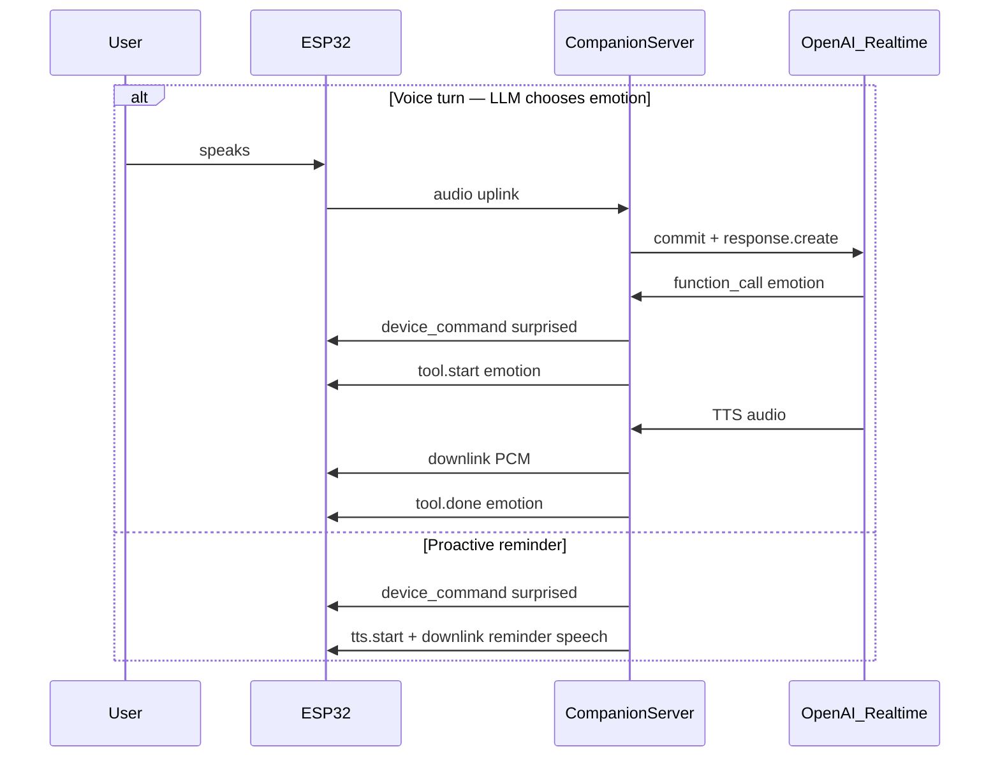

# Emotion API — Face Display Integration

How Botchill's OLED face expressions work over the WebSocket voice session. There is **no separate HTTP endpoint** — emotions are delivered as outbound `device_command` messages on `/ws`, triggered by the Realtime `emotion` tool during conversation or by the server for proactive events (e.g. task reminders).

**Transport:** WebSocket `ws://<host>:8080/ws` (same session as voice)

**Auth:** `Authorization: Bearer <DEVICE_TOKEN>` on upgrade

Full wire protocol: [STABLE_V1.md](STABLE_V1.md)

---

## Overview



The face is a **1.3" SH1106 OLED** running FluxGarage RoboEyes plus comic corner marks (anger vein, `!`, `?`, hearts, Zzz, sparkles). Implementation: `firmware/CompanionFirmware/face_display.cpp`.

---

## Wire message: `device_command`

**Direction:** server → ESP32 (outbound text frame)

**Type:** `device_command`

```json
{
  "type": "device_command",
  "action": "emotion",
  "params": {
    "pattern": "surprised",
    "duration_ms": 5000
  }
}
```

| Field | Type | Notes |
|-------|------|-------|
| `type` | string | Always `device_command` |
| `action` | string | `emotion` (alias `set_emotion` accepted on firmware) |
| `params.pattern` | string | Emotion name — see table below |
| `params.duration_ms` | number \| omitted | Optional hold time in ms; omit for firmware default |

### Allowed emotions

| `pattern` | Visual | Default hold (ms) | Typical use |
|-----------|--------|-------------------|-------------|
| `neutral` | Session mode face, no overlay | 0 (clears immediately) | Reset when expression no longer fits |
| `happy` | Warm eyes | 8000 | Mild pleasant default |
| `excited` | Sparkles + lively eyes | 8000 | Big positive news, celebration |
| `angry` | Anger vein | 10000 | Playful mock outrage (never at the user) |
| `sad` | Droopy eyes | 12000 | Loss, disappointment, heavy moment |
| `surprised` | Big round eyes + `!` | 5000 | Expectation-breaking reveal; **task/calendar reminders** |
| `confused` | `?` mark | 8000 | Can't parse what the user said |
| `sleepy` | Zzz | 15000 | Bedtime / tiredness |
| `love` | Hearts | 8000 | Affection aimed at or shared with the user |

Default holds mirror `face_display.cpp` `kEmotions[]`. Server validates `duration_ms` in **1500–60000** when provided (`CmdRouter.swift`).

After the hold expires, the face **decays back** to the current session mode face (idle, listening, thinking, speaking, etc.).

---

## How emotions are triggered

### 1. Voice conversation (`emotion` tool)

During a Realtime turn, Botchill may call the `emotion` function tool (at most **once per turn**). The server:

1. Validates the emotion name
2. Sends `device_command` to the ESP32
3. Emits `tool.start` / `tool.done` on the WebSocket for companion apps

Tool definition: `CompanionServer/Sources/CompanionServer/EmotionAgent.swift`

Personality from [CONFIG_API.md](CONFIG_API.md) (`calm`, `energetic`, `professional`) changes how often and how strongly Botchill reaches for expressive faces. Active [personas](PERSONA_API.md) add character-specific emotion bias.

### 2. Proactive reminders

When a [task](TASK_API.md) or [calendar](CALENDAR_API.md) reminder fires and the ESP is connected and idle, the server sends `surprised` **before** speaking the reminder aloud. See [PUSH_API.md](PUSH_API.md) for the full reminder flow.

---

## Companion app integration

Companion apps connected to the same `/ws` session (or building a debug UI) can observe emotions without sending them directly.

### `tool.start` — emotion in progress

```json
{
  "type": "tool.start",
  "session_id": "…",
  "turn_id": "turn-3",
  "tool": "emotion",
  "label": "surprised"
}
```

### `tool.done` — emotion completed

```json
{
  "type": "tool.done",
  "session_id": "…",
  "turn_id": "turn-3",
  "call": {
    "id": "call_…",
    "tool": "emotion",
    "action": "surprised",
    "label": "surprised",
    "status": "completed",
    "input": { "emotion": "surprised" },
    "output": { "summary": "Face set to surprised." },
    "summary": "Face set to surprised.",
    "createdAt": "2026-07-09T08:00:00Z"
  }
}
```

Use `tool.start` with `tool === "emotion"` to show a live face indicator in a Mac/iOS companion UI. Proactive reminder emotions do **not** emit `tool.start` — only the raw `device_command` reaches the device.

### TypeScript types

```typescript
export type FaceEmotion =
  | "neutral"
  | "happy"
  | "excited"
  | "angry"
  | "sad"
  | "surprised"
  | "confused"
  | "sleepy"
  | "love";

export type EmotionDeviceCommand = {
  type: "device_command";
  action: "emotion";
  params: {
    pattern: FaceEmotion;
    duration_ms?: number;
  };
};

export type ToolStartEvent = {
  type: "tool.start";
  session_id: string;
  turn_id: string;
  tool: "emotion" | string;
  label: string;
};
```

### Parsing inbound WebSocket text frames

```typescript
function handleServerMessage(json: unknown) {
  if (typeof json !== "object" || json === null || !("type" in json)) return;

  if (json.type === "device_command" && json.action === "emotion") {
    const pattern = json.params?.pattern as FaceEmotion;
    const durationMs = json.params?.duration_ms as number | undefined;
    // Update companion UI face preview
  }

  if (json.type === "tool.start" && json.tool === "emotion") {
    // Show "Botchill is reacting…" with json.label
  }
}
```

---

## Server validation

`DeviceCommandGateway` + `CmdRouter` reject invalid commands before they reach the device:

| Check | Rule |
|-------|------|
| Unknown `action` | Rejected — only `emotion`, `move`, `set_led` |
| Unknown `pattern` | Rejected — must be one of the nine emotions above |
| `duration_ms` out of range | Rejected — must be 1500–60000 when present |

Invalid commands are logged server-side and never sent to the ESP32.

---

## Firmware behavior

On receive (`ws_session.cpp`):

```
device_command action=emotion pattern=surprised duration=5000
→ faceDisplaySetEmotion("surprised", 5000)
```

- `neutral` clears the emotion overlay immediately
- Unknown pattern → logged as rejected, no face change
- Emotion rides **on top of** session mode (listening, speaking, etc.)
- `faceDisplayLoop()` checks expiry each frame and resets to mode face when hold ends

---

## Errors

| Situation | Behavior |
|-----------|----------|
| ESP offline | `emotion` tool returns error to LLM; proactive reminder skips Botchill path |
| Invalid emotion in tool call | Tool output: `unknown emotion: …` |
| Session busy (capturing/TTS) | Proactive reminder voice skipped; emotion may still have been sent if delivery started |

---

## Related docs

- [STABLE_V1.md](STABLE_V1.md) — WebSocket protocol, `device_command` event list
- [CONFIG_API.md](CONFIG_API.md) — `personality` affects expression frequency
- [PERSONA_API.md](PERSONA_API.md) — persona-specific emotion mapping
- [TASK_API.md](TASK_API.md) / [CALENDAR_API.md](CALENDAR_API.md) — reminders trigger `surprised`
- [PUSH_API.md](PUSH_API.md) — Mac push when reminders fire
