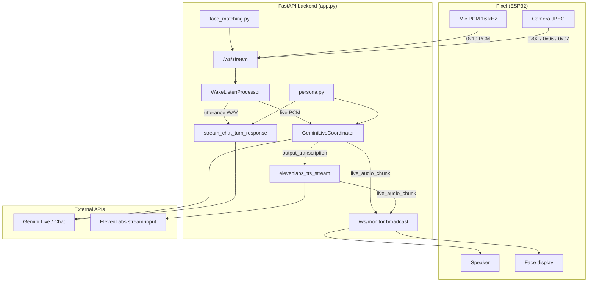

# OmniBot Backend — Technical Reference

Canonical source: [nazirlouis/OmniBot `app/backend`](https://github.com/nazirlouis/OmniBot/tree/main/app/backend)

This document describes the **OmniBot hub backend** as implemented in the Python/FastAPI layer: voice, vision, persona, face recognition, and how they connect to the Pixel desktop robot (ESP32 firmware) and the web dashboard.

---

## 1. System overview

OmniBot is a **multi-modal voice companion hub** for a small desktop robot (“Pixel”) with a round face display. The backend:

- Accepts **continuous audio** (and optional **camera JPEGs**) from ESP32 over WebSocket
- Runs **wake-word detection** and **VAD** (voice activity detection) on the hub
- Streams conversation to **Google Gemini Live API** (primary path) or **REST Gemini Chat** (fallback)
- Optionally replaces Gemini native TTS with **ElevenLabs WebSocket streaming TTS**
- Maintains **OpenClaw-style persona files** (SOUL, USER, MEMORY, …) per device
- Performs **face enrollment/matching** (InsightFace) for presence greetings
- Broadcasts state to a **dashboard** via a monitor WebSocket fan-out

---

## 2. Repository layout (`app/backend/`)

| Path | Role |
|------|------|
| `app.py` | FastAPI app, WebSocket routes, ESP32 protocol, tool execution, REST chat |
| `gemini_live_session.py` | Per-device Gemini Live session coordinator |
| `elevenlabs_tts_stream.py` | ElevenLabs WebSocket realtime TTS → PCM 24 kHz |
| `wake_listen.py` | openWakeWord + WebRTC VAD utterance segmentation |
| `persona.py` | SOUL/USER/MEMORY markdown persona system |
| `heartbeat_service.py` | Periodic MEMORY consolidation from daily logs |
| `face_matching.py` | InsightFace enrollment + cosine match |
| `hub_config.py` | Data dir, API keys, `google.genai.Client` singleton |
| `grounding_extract.py` | Google Search grounding metadata helpers |
| `pixel_tool_declarations.py` | Function declarations for face animation tools |
| `persona_defaults/` | Git-tracked template markdown files |
| `models/wake/pixel.onnx` | Optional custom wake word model |
| `data/face_profiles/` | Runtime face profile storage |

---

## 3. Runtime stack

- **Python** + **FastAPI** + **uvicorn**
- **google-genai** ≥ 1.50 (`google.genai.Client`, Live API, Chat API)
- **websockets** — ElevenLabs stream-input client
- **openwakeword** + **webrtcvad** — wake + end-of-utterance
- **insightface** + **onnxruntime** — face embeddings (CPU)
- **opencv-python-headless**, **numpy**, **imageio** + **ffmpeg** — JPEG/video assembly
- **bleak** — BLE Wi-Fi provisioning scan

Default bind: `0.0.0.0:8000` (`HOST` / `PORT` env).

---

## 4. Configuration

### 4.1 Environment (`.env`)

| Variable | Purpose |
|----------|---------|
| `GEMINI_API_KEY` | Required for all Gemini paths |
| `ELEVENLABS_API_KEY` | Optional; required for ElevenLabs TTS modes |
| `NOMINATIM_USER_AGENT` | Geocoding user-agent (Maps-related tooling) |
| `OMNIBOT_DATA_DIR` | Override data directory (default: directory containing `app.py`) |
| `OMNIBOT_USE_GEMINI_LIVE` | `0`/`false` disables Live; forces REST wake path |
| `OMNIBOT_LIVE_VOICE_NAME` | Gemini prebuilt voice (default `Umbriel`) |
| `OMNIBOT_WAKE_WORD_MODEL` | Path to custom `.onnx` wake model |
| `OMNIBOT_WAKE_THRESHOLD` | Wake score threshold (default `0.55`) |
| `OMNIBOT_WAKE_SILENCE_MS` | Trailing silence to end utterance (default `550`) |
| `OMNIBOT_WAKE_COOLDOWN_S` | Post-wake cooldown (default `1.2`) |
| `OMNIBOT_FOLLOW_UP_S` | Fallback post-reply listen window (default `5`) |