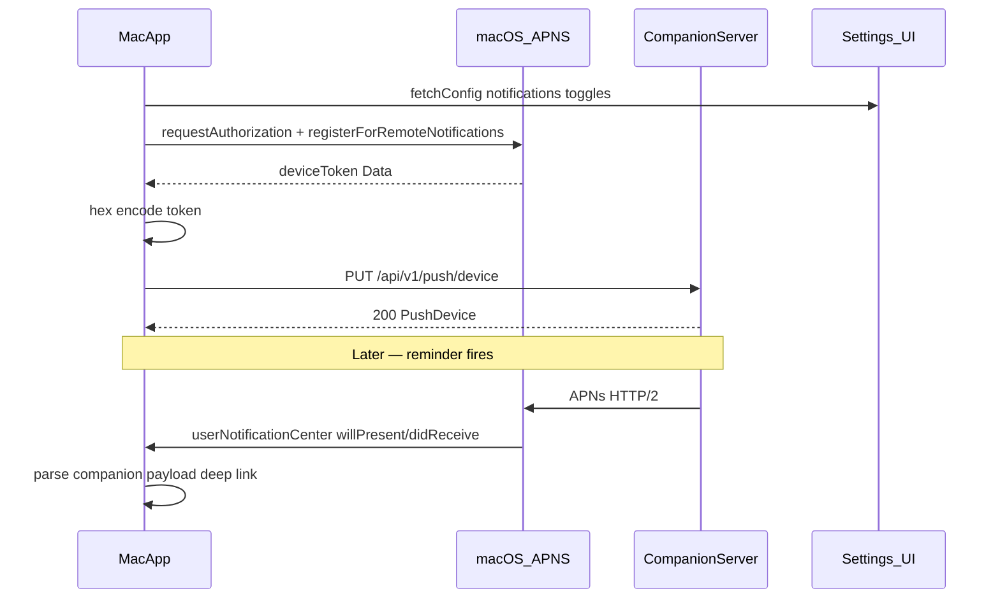

# Push API — Mac App Integration

REST endpoints for registering a macOS app to receive APNs reminder notifications. Reminders are scheduled server-side when tasks or calendar events are created; at fire time the server sends push alerts to all registered devices.

**Base URL:** `http://localhost:8080` (CompanionServer default)

**Auth:** Same bearer token as WebSocket and other REST APIs (`DEVICE_TOKEN` in `.env`).

```
Authorization: Bearer <DEVICE_TOKEN>
```

---

## Prerequisites (Mac app + server)

### Mac app

1. Enable **Push Notifications** capability in Xcode.
2. Request user permission and register for remote notifications.
3. On `didRegisterForRemoteNotificationsWithDeviceToken`, hex-encode the token and call `PUT /api/v1/push/device`.
4. On logout or token invalidation, call `DELETE /api/v1/push/device`.
5. Handle notification tap via `companion.id` in the payload to deep-link to the task or event.

### CompanionServer (APNs delivery)

Set these in `.env` (all required for push delivery; registration endpoints work without them):

| Variable | Purpose |
|----------|---------|
| `APNS_KEY_ID` | Key ID from Apple Developer |
| `APNS_TEAM_ID` | Team ID |
| `APNS_PRIVATE_KEY_PATH` | Path to `.p8` auth key |
| `APNS_BUNDLE_ID` | Default topic if device row omits bundle id |

Use `sandbox` environment for development builds; `production` for App Store / notarized builds.

---

## Push device object

```json
{
  "id": "push_macos_abc123def4567890",
  "platform": "macos",
  "deviceToken": "abc123def4567890",
  "bundleId": "com.example.botchill",
  "environment": "sandbox",
  "updatedAt": "2026-07-09T08:00:00Z"
}
```

| Field | Type | Notes |
|-------|------|-------|
| `id` | string | Stable server-assigned ID |
| `platform` | enum | `macos` (only value in v1) |
| `deviceToken` | string | Hex APNs device token |
| `bundleId` | string | App bundle ID (APNs topic) |
| `environment` | enum | `sandbox` \| `production` |
| `updatedAt` | string (ISO 8601 UTC) | Last registration time |

---

## Endpoints

### Register device token

```
PUT /api/v1/push/device
Content-Type: application/json
```

**Request body:**

```json
{
  "platform": "macos",
  "deviceToken": "<hex APNs device token>",
  "bundleId": "com.example.botchill",
  "environment": "sandbox"
}
```

Idempotent upsert on `(platform, deviceToken)`.

**Response `200`:** Push device object (shape above).

**Response `400`:** empty token, empty bundle id, or unsupported platform.

### Unregister device token

```
DELETE /api/v1/push/device
Content-Type: application/json
```

**Request body:**

```json
{
  "deviceToken": "<hex APNs device token>"
}
```

**Response `204`:** device removed.

**Response `404`:** token not found.

---

## APNs notification payload

When a reminder fires, registered Mac devices receive:

```json
{
  "aps": {
    "alert": {
      "title": "Task reminder",
      "body": "Finish report is due in 10 minutes"
    },
    "sound": "default"
  },
  "companion": {
    "type": "reminder",
    "kind": "task",
    "id": "task_xyz",
    "title": "Finish report",
    "fireAt": "2026-07-09T16:50:00Z",
    "dueAt": "2026-07-09T17:00:00Z",
    "remindBeforeMinutes": 10
  }
}
```

For calendar events: `kind` is `"event"`, `id` is `evt_...`, and `startsAt` replaces `dueAt`.

Title strings: `"Task reminder"` or `"Calendar reminder"`.

---

## Frontend integration

### Integration flow



### Mac app checklist

| Step | When | Action |
|------|------|--------|
| 1 | App launch | Load `DEVICE_TOKEN` + server base URL from config |
| 2 | Settings screen | Read/write `notifications.taskReminders`, `calendarAlerts`, `remindBeforeMinutes` via [CONFIG_API.md](CONFIG_API.md) |
| 3 | User enables notifications | `UNUserNotificationCenter.requestAuthorization` |
| 4 | After permission granted | `NSApplication.shared.registerForRemoteNotifications()` |
| 5 | `didRegisterForRemoteNotificationsWithDeviceToken` | Hex-encode token → `PUT /api/v1/push/device` |
| 6 | Token refresh | Re-call `PUT` (idempotent upsert) |
| 7 | Logout / disable notifications | `DELETE /api/v1/push/device` |
| 8 | Notification tap | Route by `companion.kind` + `companion.id` |

**Environment:** use `sandbox` for debug/Xcode runs; `production` for TestFlight / App Store / notarized builds. Mismatch between app build type and `environment` is the most common reason pushes never arrive.

**Server URL:** same host as other REST APIs (`http://localhost:8080` in dev; LAN IP in production).

---

## Frontend examples

### TypeScript types

```typescript
export type PushEnvironment = "sandbox" | "production";

export type PushDevice = {
  id: string;
  platform: "macos";
  deviceToken: string;
  bundleId: string;
  environment: PushEnvironment;
  updatedAt: string;
};

export type RegisterPushDeviceRequest = {
  platform: "macos";
  deviceToken: string;
  bundleId: string;
  environment: PushEnvironment;
};

export type DeletePushDeviceRequest = {
  deviceToken: string;
};

export type ReminderPushPayload = {
  type: "reminder";
  kind: "task" | "event";
  id: string;
  title: string;
  fireAt: string;
  dueAt?: string;
  startsAt?: string;
  remindBeforeMinutes: number;
};

export type ApsAlert = {
  title: string;
  body: string;
};

export type IncomingReminderNotification = {
  aps: {
    alert: ApsAlert;
    sound?: string;
  };
  companion: ReminderPushPayload;
};
```

### TypeScript API client

```typescript
const token = process.env.DEVICE_TOKEN!;
const baseURL = process.env.COMPANION_BASE_URL ?? "http://localhost:8080";

function authHeaders(): HeadersInit {
  return { Authorization: `Bearer ${token}` };
}

function jsonHeaders(): HeadersInit {
  return {
    ...authHeaders(),
    "Content-Type": "application/json",
  };
}

export async function registerPushDevice(
  apnsToken: string,
  bundleId: string,
  environment: PushEnvironment = "sandbox"
): Promise<PushDevice> {
  const res = await fetch(`${baseURL}/api/v1/push/device`, {
    method: "PUT",
    headers: jsonHeaders(),
    body: JSON.stringify({
      platform: "macos",
      deviceToken: apnsToken,
      bundleId,
      environment,
    } satisfies RegisterPushDeviceRequest),
  });

  if (!res.ok) {
    throw new Error(`push register failed: ${res.status}`);
  }

  return res.json();
}

export async function unregisterPushDevice(
  deviceToken: string
): Promise<void> {
  const res = await fetch(`${baseURL}/api/v1/push/device`, {
    method: "DELETE",
    headers: jsonHeaders(),
    body: JSON.stringify({ deviceToken } satisfies DeletePushDeviceRequest),
  });

  if (res.status === 404) return; // already gone
  if (!res.ok) {
    throw new Error(`push unregister failed: ${res.status}`);
  }
}
```

### Parse incoming APNs payload (TypeScript / Electron)

If your Mac app receives pushes via a native bridge or debug webhook, parse the `companion` envelope:

```typescript
export type ReminderDeepLink =
  | { screen: "task"; id: string }
  | { screen: "event"; id: string };

export function parseReminderNotification(
  userInfo: Record<string, unknown>
): ReminderDeepLink | null {
  const companion = userInfo.companion as ReminderPushPayload | undefined;
  if (!companion || companion.type !== "reminder") return null;

  if (companion.kind === "task") {
    return { screen: "task", id: companion.id };
  }
  if (companion.kind === "event") {
    return { screen: "event", id: companion.id };
  }
  return null;
}

// Usage in notification click handler:
// const link = parseReminderNotification(notification.request.content.userInfo);
// if (link?.screen === "task") navigate(`/tasks/${link.id}`);
// if (link?.screen === "event") navigate(`/calendar/${link.id}`);
```

### curl

**Register:**

```bash
curl -s -X PUT "http://localhost:8080/api/v1/push/device" \
  -H "Authorization: Bearer $DEVICE_TOKEN" \
  -H "Content-Type: application/json" \
  -d '{
    "platform": "macos",
    "deviceToken": "abc123def4567890",
    "bundleId": "com.example.botchill",
    "environment": "sandbox"
  }'
```

**Unregister:**

```bash
curl -s -X DELETE "http://localhost:8080/api/v1/push/device" \
  -H "Authorization: Bearer $DEVICE_TOKEN" \
  -H "Content-Type: application/json" \
  -d '{"deviceToken":"abc123def4567890"}' \
  -w "\nHTTP %{http_code}\n"
```

---

### Swift — API client

```swift
import Foundation

enum PushEnvironment: String, Codable {
    case sandbox
    case production
}

struct PushDevice: Decodable {
    let id: String
    let platform: String
    let deviceToken: String
    let bundleId: String
    let environment: PushEnvironment
    let updatedAt: Date
}

struct RegisterPushDeviceRequest: Encodable {
    let platform = "macos"
    let deviceToken: String
    let bundleId: String
    let environment: PushEnvironment
}

struct DeletePushDeviceRequest: Encodable {
    let deviceToken: String
}

struct ReminderPushPayload: Decodable {
    let type: String
    let kind: String
    let id: String
    let title: String
    let fireAt: String
    let dueAt: String?
    let startsAt: String?
    let remindBeforeMinutes: Int
}

final class PushAPIClient {
    private let baseURL: URL
    private let deviceToken: String
    private let decoder: JSONDecoder
    private let encoder: JSONEncoder

    init(baseURL: URL, deviceToken: String) {
        self.baseURL = baseURL
        self.deviceToken = deviceToken
        self.decoder = JSONDecoder()
        self.decoder.dateDecodingStrategy = .iso8601
        self.encoder = JSONEncoder()
    }

    func register(
        apnsDeviceToken: String,
        bundleId: String,
        environment: PushEnvironment
    ) async throws -> PushDevice {
        var request = URLRequest(url: baseURL.appendingPathComponent("/api/v1/push/device"))
        request.httpMethod = "PUT"
        request.setValue("Bearer \(deviceToken)", forHTTPHeaderField: "Authorization")
        request.setValue("application/json", forHTTPHeaderField: "Content-Type")
        request.httpBody = try encoder.encode(
            RegisterPushDeviceRequest(
                deviceToken: apnsDeviceToken,
                bundleId: bundleId,
                environment: environment
            )
        )

        let (data, response) = try await URLSession.shared.data(for: request)
        guard let http = response as? HTTPURLResponse, http.statusCode == 200 else {
            throw URLError(.badServerResponse)
        }
        return try decoder.decode(PushDevice.self, from: data)
    }

    func unregister(apnsDeviceToken: String) async throws {
        var request = URLRequest(url: baseURL.appendingPathComponent("/api/v1/push/device"))
        request.httpMethod = "DELETE"
        request.setValue("Bearer \(deviceToken)", forHTTPHeaderField: "Authorization")
        request.setValue("application/json", forHTTPHeaderField: "Content-Type")
        request.httpBody = try encoder.encode(
            DeletePushDeviceRequest(deviceToken: apnsDeviceToken)
        )

        let (_, response) = try await URLSession.shared.data(for: request)
        guard let http = response as? HTTPURLResponse,
              http.statusCode == 204 || http.statusCode == 404
        else {
            throw URLError(.badServerResponse)
        }
    }
}
```

### Swift — register on APNs token (AppDelegate)

```swift
import AppKit
import UserNotifications

extension Data {
    /// APNs device token as lowercase hex (no spaces) — matches server storage format.
    var hexEncodedString: String {
        map { String(format: "%02x", $0) }.joined()
    }
}

@MainActor
final class AppDelegate: NSObject, NSApplicationDelegate {
    private let pushClient = PushAPIClient(
        baseURL: URL(string: "http://localhost:8080")!,
        deviceToken: ProcessInfo.processInfo.environment["DEVICE_TOKEN"]!
    )

    func applicationDidFinishLaunching(_ notification: Notification) {
        Task { await requestNotificationPermission() }
    }

    private func requestNotificationPermission() async {
        let center = UNUserNotificationCenter.current()
        let granted = try? await center.requestAuthorization(options: [.alert, .sound, .badge])
        guard granted == true else { return }
        NSApplication.shared.registerForRemoteNotifications()
    }

    func application(_ application: NSApplication,
                     didRegisterForRemoteNotificationsWithDeviceToken deviceToken: Data) {
        let hex = deviceToken.hexEncodedString
        let bundleId = Bundle.main.bundleIdentifier ?? "com.example.botchill"
        #if DEBUG
        let environment = PushEnvironment.sandbox
        #else
        let environment = PushEnvironment.production
        #endif

        Task {
            do {
                _ = try await pushClient.register(
                    apnsDeviceToken: hex,
                    bundleId: bundleId,
                    environment: environment
                )
            } catch {
                // Log — registration can be retried on next launch
            }
        }
    }

    func application(_ application: NSApplication,
                     didFailToRegisterForRemoteNotificationsWithError error: Error) {
        // No APNs entitlements, simulator, or network issue
    }
}
```

### Swift — handle notification tap + deep link

```swift
import UserNotifications

enum ReminderDeepLink: Equatable {
    case task(id: String)
    case event(id: String)
}

func parseReminderDeepLink(userInfo: [AnyHashable: Any]) -> ReminderDeepLink? {
    guard let companion = userInfo["companion"] as? [String: Any],
          companion["type"] as? String == "reminder",
          let kind = companion["kind"] as? String,
          let id = companion["id"] as? String
    else { return nil }

    switch kind {
    case "task": return .task(id: id)
    case "event": return .event(id: id)
    default: return nil
    }
}

// In your UNUserNotificationCenterDelegate:
func userNotificationCenter(
    _ center: UNUserNotificationCenter,
    willPresent notification: UNNotification
) async -> UNNotificationPresentationOptions {
    // Show banner + sound even when app is in foreground
    [.banner, .sound]
}

func userNotificationCenter(
    _ center: UNUserNotificationCenter,
    didReceive response: UNNotificationResponse
) async {
    let userInfo = response.notification.request.content.userInfo
    guard let link = parseReminderDeepLink(userInfo: userInfo) else { return }

    switch link {
    case .task(let id):
        // Open task detail — fetch via GET /api/v1/tasks/{id}
        break
    case .event(let id):
        // Open event detail — fetch via GET /api/v1/calendar/events/{id}
        break
    }
}
```

### Settings screen wiring

Notification preferences live in [CONFIG_API.md](CONFIG_API.md) — the push registration endpoints do **not** store toggles. Wire your Settings UI like this:

| UI control | Config field | Notes |
|------------|--------------|-------|
| Task reminders toggle | `notifications.taskReminders` | When off, server skips task push |
| Calendar alerts toggle | `notifications.calendarAlerts` | When off, server skips event push |
| Remind before picker (5/10/15/30 min) | `notifications.remindBeforeMinutes` | Recomputes pending reminder times |

Example — disable task reminders but keep device registered:

```typescript
import { patchConfig } from "./config-api";

await patchConfig({ notifications: { taskReminders: false } });
// Device token stays registered; only task pushes stop.
```

### Deep link routing

| `companion.kind` | `companion.id` prefix | Navigate to | Fetch detail |
|------------------|----------------------|-------------|--------------|
| `task` | `task_` | Task detail view | `GET /api/v1/tasks/{id}` |
| `event` | `evt_` | Calendar event view | `GET /api/v1/calendar/events/{id}` |

---

## Reminder behavior

Reminders are driven by [CONFIG_API.md](CONFIG_API.md) notification settings:

| Config field | Effect |
|--------------|--------|
| `notifications.taskReminders` | Gate task reminders |
| `notifications.calendarAlerts` | Gate calendar reminders |
| `notifications.remindBeforeMinutes` | Offset before `dueAt` / `startsAt` |

Creating or updating a task with `dueAt`, or an event with `startsAt`, schedules a server-side reminder job. At fire time:

1. **Botchill (ESP32)** — if connected and idle: `surprised` face + spoken reminder ([EMOTION_API.md](EMOTION_API.md)).
2. **Mac app (APNs)** — push sent to all registered devices (when APNs env is configured).

See [TASK_API.md](TASK_API.md) and [CALENDAR_API.md](CALENDAR_API.md) for create/update endpoints.

---

## Errors

| Status | When |
|--------|------|
| `401` | Missing or invalid `Authorization` header |
| `400` | Invalid platform, empty token, or empty bundle id |
| `404` | DELETE — token not found |
| `503` | Postgres unavailable |

---

## Local setup

1. Start Postgres: `cd CompanionServer && docker-compose up -d`
2. Copy `.env.example` → `.env` and set `DEVICE_TOKEN`
3. Optionally set `APNS_*` vars for real push delivery
4. Start server: `swift run CompanionServer`

### Running API tests

```bash
cd CompanionServer
swift test --filter PushAPITests
```

Tests use `DATABASE_URL` and skip automatically if Postgres is unavailable.

---

## Related docs

- [CONFIG_API.md](CONFIG_API.md) — `personality` affects expression frequency
- [EMOTION_API.md](EMOTION_API.md) — `device_command` face protocol and `tool.start` events
- [TASK_API.md](TASK_API.md) — Task create/update schedules reminders
- [CALENDAR_API.md](CALENDAR_API.md) — Event create/update schedules reminders
